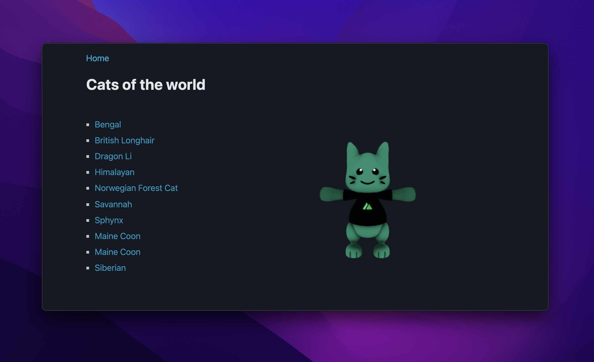

# Building for the Edge with Nuxt 3

This is a live-coded demo project using [Nuxt 3](https://v3.nuxtjs.org/) for a live-coding session accompanying a talk at [vuejs.de Conf 2022](https://conf.vuejs.de/).

<p align="center">
  <a href="https://vuejs-de.netlify.app/" target="_blank">
    
  </a>
</p>

- [✨ &nbsp;Live Demo](https://vuejs-de.netlify.app/)

## Features

- Based on [Nuxt 3](https://v3.nuxtjs.org/)
- Server API routes using [Nuxt Nitro](https://v3.nuxtjs.org/concepts/server-engine)
- 3D cat model by [**@alvarosabu**](https://github.com/alvarosabu)
- API from [The Cat API](https://thecatapi.com/)
- Light & dark mode using [pico.css](https://picocss.com/docs/)

## Try it out

### Setup

```bash
# install dependencies
npm install # or yarn

# serve in dev mode, with hot reload at localhost:3000
npm run dev

# build for production (universal)
npm run build

# preview in production mode
npm start
```

You'll need to [get a token](https://thecatapi.com/signup) for the Cat API; place it in `.env`.

### Deployment

You should be able to deploy this repository with zero or minimal configuration.

- [Azure](https://v3.nuxtjs.org/docs/deployment/azure)
- [Cloudflare Workers](https://v3.nuxtjs.org/docs/deployment/cloudflare)
- [Firebase Hosting](https://v3.nuxtjs.org/docs/deployment/firebase)
- [Netlify](https://v3.nuxtjs.org/docs/deployment/netlify)
- [Vercel](https://v3.nuxtjs.org/docs/deployment/vercel)
- ... and more

However, the route rules for CORS and ISR/ISG in `nuxt.config` won't work until the following PRs are finalised and merged - follow them for more info:

- https://github.com/unjs/nitro/pull/538
- https://github.com/nuxt/framework/pull/7954
- https://github.com/nuxt/framework/pull/7938
- https://github.com/unjs/nitro/pull/540
- https://github.com/unjs/nitro/pull/545

## License

MIT
